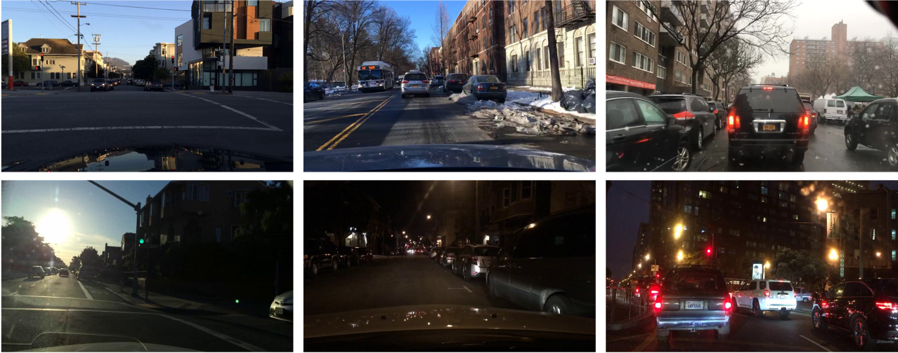
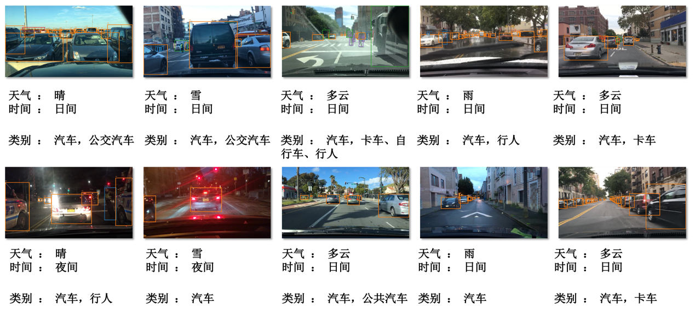

# DCLA
The dataset of DCLA (**D**omain **C**ontinual **L**earning datasets for **A**utonomous).


## 🎨 Introduction

The DCLA (Domain Continual Learning Datasets for Autonomous) is an intelligent transportation object detection dataset specifically designed for domain continual learning. It comprises a total of 28,892 images, including 24,689 training images and 4,203 testing images. The dataset covers five common object categories in traffic scenarios and five scene categories classified based on weather conditions.

<p align="center"></p>

DCLA focuses on continual learning tasks, particularly domain incremental learning, across various domains. The collected data includes traffic scenes from different cities, diverse traffic scenarios, various time periods, and different weather conditions. The five primary traffic object categories included in the dataset are: **pedestrian**, **car**, **bus**, **bicycle**, and **truck**.

<p align="center"></p>


|          | Sunny | Cloudy | Overcast | Rain | Snow | Total   |
|----------|-------|--------|----------|------|------|---------|
| Train Set | 4936  | 4977   | 4860     | 4955 | 4961 | 24689   |
| Test Set  | 989   | 993    | 733      | 727  | 761  | 4203    |
| Total     | 5925  | 5970   | 5593     | 5782 | 5722 | 28892   |


## :open_file_folder: Download Dataset

The download links of Google Drive and Baidu Netdisk:

|  | Link |
| -------- | -------- |
| Google Drive     | [Download](https://drive.google.com/file/d/1te66SUMWttEsFrRZImOC4Y29n0TZhhNB/view?usp=drive_link)     |
| Baidu Netdisk | [Download]( https://pan.baidu.com/s/1O1zOyY8-Pqg0huHUEH0ikw?pwd=i4ub) |


## :pushpin: Structure
Below is an overview of the directory and file structure:
```
  DCLA
    ├─images         #  The original images
    │  ├─val               # Validation dataset
    │  │  ├─rainy                 # "Rainy" weather
    │  │  │   ├─00ce6f6d-50bbee62.jpg    # Example image file
    │  │  │   ├─00d77344-9fe25620.jpg
    │  │  │   └─...
    │  │  ├─total
    │  │  ├─snowy
    │  │  ├─clear
    │  │  ├─overcast
    │  │  └─partly cloudy
    │  └─train
    │      ├─rainy
    │      ├─snowy
    │      ├─clear
    │      ├─overcast
    │      └─partly cloudy
    └─annotations       # Annotation files
        ├─clear_train.json
        ├─clear_val.json
        ├─overcast_train.json
        └─...
```

## :pencil: Citation
If this codebase is useful to you, please cite our work:
```
@misc{DCLA2024,
  title        = {Domain Continual Learning Datasets for Autonomous (DCLA) Dataset},
  author       = {Yan Fang and Xiao Yu and Hongguang Zhu and Yunchao Wei and Yao Zhao},
  institution  = {The Institute of Information Science, Beijing Jiaotong University},
  howpublished = {\url{https://github.com/hhhhh12131/DCLA}},
  year         = {2024}
}
```
